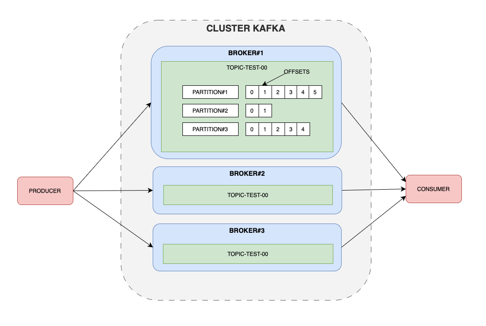

# Kafka-spring-boot

knowledge about Kafka using spring boot 

## Apache Kafka

Apache Kafka is an open-source distributed event streaming platform used by thousands of companies for high-performance data pipelines, streaming analytics, data integration, and mission-critical applications.

## Broker 

A broker in Apache Kafka is a server that stores, manages, and delivers messages. Brokers are the core components of the Kafka ecosystem. 

### What do brokers do? 

- Receive messages: Brokers receive messages from producers
- Store messages: Brokers store messages in topic partitions, which are log files
- Deliver messages: Brokers deliver messages to consumers
- Manage partitions: Brokers manage partitions, which are divisions of topics
- Replicate partitions: Brokers replicate partitions between each other to provide redundancy
- Handle requests: Brokers handle requests to write and read events

## Topics

In Apache Kafka, a topic is a logical category for organizing events or messages. Topics are similar to folders in a filesystem, where events are the files in that folder. 

### Characteristics of topics

- Append-only: New messages are added to the end of the log 
- Immutable: Events cannot be modified after they are written 
- Durable: Logs are stored on disk 
- Scalable: Topics can be configured to expire data after a certain age or size 
- Multi-producer and multi-subscriber: A topic can have multiple producers and consumers 

### How topics are used

- Developers use topics to hold different types of events 
- Developers use topics to hold filtered and transformed versions of the same type of event 
- Topics are key to publish-subscribe systems 
- Topics act as message queues where producers publish data and consumers retrieve it 

### How to create a topic

```docker
# Topic create
> docker exec -it kafka bash
> kafka-topics --bootstrap-server kafka:9092 --create --topic topic-test-00 --partitions 5 --replication-factor 1

# Topics list
> docker exec -it kafka bash
> kafka-topics --bootstrap-server kafka:9092 --list

# Topics describe
> docker exec -it kafka bash
> kafka-topics --bootstrap-server kafka:9092 --describe --topic topic-test-00 

# Topic update
> docker exec -it kafka bash
> kafka-topics --bootstrap-server kafka:9092 --alter --topic topic-test-00 --partitions 10 --replication-factor 2

# Topic delete
> docker exec -it kafka bash
> kafka-topics --bootstrap-server kafka:9092 --delete --topic topic-test-00

# Topics remove setting 
> docker exec -it kafka bash
> kafka-configs --bootstrap-server kafka:9092 --entity-type topics --entity-name topicTest00 --alter --delete-config x
```

- --bootstrap-server **kafka:9092** "kafka server"
- --create --topic **topic-test-00** "name of topic to create"
- --partitions **5** "partitions number"
- --replication-factor **1** "replication number of broker"

### Diagram



### Throughput

Throughput in Apache Kafka is the number of messages processed in a given time period. It is a key performance metric that measures how efficient data streaming operations are. 

### Why is throughput important?

High throughput is important for applications that process large amounts of data quickly. 
Throughput is often defined in terms of records per second or megabytes (MB) per second. 

### How to improve throughput? 

- Optimize Kafka configuration parameters
- Increase the number of producers, partitions, and consumers
- Tune producer configurations

### Other Kafka performance metrics 

- Latency: The amount of time it takes to process each message

### Kafka architecture

Kafka's architecture is designed to handle high-throughput, low-latency event streaming. It uses a distributed, partitioned, and replicated log service provided by its brokers. 

## Message

A message in Apache Kafka is a unit of data that is stored as a record. A record is made up of a key, value, and timestamp. 

### Message components 

- Key: An optional field that can be used to identify the message and determine which partition to send it to
- Value: The actual data payload of the message
- Timestamp: The time at which the message was created

### Message formats 

- Messages can be in any format, but the most common are JSON, Avro, and string
- Messages are stored as serialized bytes, and consumers are responsible for de-serializing them

### Message delivery

- Kafka offers different message delivery guarantees, including at most once, at least once, and exactly once 
- The maximum message size that Kafka will allow is set by default to 1 MB, but this can be adjusted 
### Message use cases 

- Messages can be used to record events, such as a payment or page view, for tracking user activity and analyzing user behavior.

## Producer

An Apache Kafka producer is a client application that sends events to a Kafka cluster. It's a simpler concept than the consumer because it doesn't require group coordination. 

### How does a Kafka producer work?

- A producer serializes a message into a byte array 
- A producer assigns a message key to determine the partition to write to 
- A producer sends the message to a topic 
- The broker adds a partition and offset ID to the message 

### What are some features of a Kafka producer?

- A producer can batch records together for efficiency 
- A producer can automatically retry if a request fails 
- A producer can maintain buffers of unsent records for each partition 
- A producer can trade a small amount of additional latency for better throughput 

```docker
# Create a new producer
> docker exec -it kafka bash
> kafka-console-producer --bootstrap-server kafka:9092 --topic topic-test-00
```

## Consumer

An Apache Kafka consumer is a client application that reads and processes data from Kafka brokers. Consumers are used by applications that need to receive messages from topics within Apache Kafka. 

### How does a consumer work? 
- A consumer issues a fetch request to a broker to get data from a partition
- The consumer receives a chunk of log that starts with the offset position specified in the request
- The consumer processes the records and asks for more data
- The consumer can specify an offset to reconsume data if needed

### Features of a consumer

- Consumers can subscribe to multiple topics using a regular expression 
- Consumers can perform multiple fetches in parallel 
- Consumers can control when records are considered consumed and commit their offsets 
- Consumers can be configured to automatically commit messages after reading them 

### Related concepts 

- Producers: Send messages to Kafka
- Consumer groups: Consumers can be grouped together
- Offsets: Track the position of a consumer

```docker
# Create a new consumer
> docker exec -it kafka bash
> kafka-console-consumer --bootstrap-server kafka:9092 --topic topic-test-00 --from-beginning
--property print.key=true
--property key.separator="-"
```

## Offset lag

In Apache Kafka, offset lag is the difference between the latest available offset in a partition and the offset that a consumer group has consumed. It's a metric that indicates how far behind the consumer group is from the latest available data. 

### How is offset lag calculated?

- The current offset is the last committed message of the consumer for a partition. 
- The log end offset is the highest offset in a partition, which is the offset of the last message written to that partition. 
- The difference between the log end offset and the current offset is the consumer lag. 

### Why is offset lag important? 

- High offset lag indicates that consumers can't keep up with the incoming data.
- The rate of change of consumer group lag can indicate potential problems and whether attempts to mitigate increases in lag are working.

### How can offset lag be monitored?

- You can monitor offset lag using the Java Client Metrics. 
- You can use the Kafka consumer group script to see details about the consumer group performance. 
- You can use Burrow, a monitoring solution for Kafka that provides consumer lag checking as a service. 


## Docker Commands 

Here wirte docker commands to shared.

### docker hello-world

```docker
# Docker version
> docker version

# Pull from docker hub 'hello-world' image
> docker pull hello-world

# Look local docker images
> docker images 

# Run image
> docker run image-name

# Container is running 
> docker ps

```

## Docker Compose

docker-compose.yml

```docker
version: '3.8'

services:
  zookeeper:
    image: confluentinc/cp-zookeeper:latest
    container_name: zookeeper
    environment:
      ZOOKEEPER_CLIENT_PORT: 2181
      ZOOKEEPER_TICK_TIME: 2000
    ports:
      - 2181:2181

  kafka:
    image: confluentinc/cp-kafka:latest
    container_name: kafka
    depends_on:
      - zookeeper
    environment:
      KAFKA_BROKER_ID: 1
      KAFKA_ZOOKEEPER_CONNECT: 'zookeeper:2181'
      KAFKA_LISTENER_SECURITY_PROTOCOL_MAP: PLAINTEXT:PLAINTEXT,PLAINTEXT_INTERNAL:PLAINTEXT
      KAFKA_ADVERTISED_LISTENERS: PLAINTEXT://localhost:9092,PLAINTEXT_INTERNAL://broker:29092
      KAFKA_OFFSETS_TOPIC_REPLICATION_FACTOR: 1
      KAFKA_TRANSACTION_STATE_LOG_MIN_ISR: 1
      KAFKA_TRANSACTION_STATE_LOG_REPLICATION_FACTOR: 1
    ports:
      - "9092:9092"

```

### Simple example of Apache Kafka

```docker
# Create a new topic
> docker exec -it kafka bash
> kafka-topics --bootstrap-server kafka:9092 --create --topic topic-test-00

# Create a new producer
> docker exec -it kafka bash
> kafka-console-producer --bootstrap-server kafka:9092 --topic topic-test-00

# Create a new consumer
> docker exec -it kafka bash
> kafka-console-consumer --bootstrap-server kafka:9092 --topic topic-test-00 --from-beginning

# Run docker-compose file
> docker-compose up -d

# Down execute docker-compose file
> docker-compose down

# Topics list
> docker exec -it kafka bash
> kafka-topics --list --bootstrap-server kafka:9092

# Topics describe
> docker exec -it kafka bash
> kafka-topics --describe --topic topic-test-00 --bootstrap-server kafka:9092
```

[Doccker Hub](https://hub.docker.com/_/hello-world)
